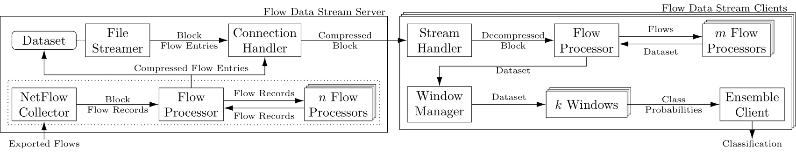

# Flow Data Streaming Client Ensemble
Dependencies: Python version: 3.6+ (for used packages see [utils.py](utils.py))

## Description and Usage

The Flow Data Streaming Client Ensemble realizes the Normalization step of the Data Preparation stage as well as the Machine Learning stage (see Flow Data Streaming Pipeline).
Prepared flow data is received from the [Flow Data Streaming Server](https://gitlab.cs.hs-fulda.de/flow-data-ml/cnsm2019/flow-data-streaming-server) and further preprocessed (feature filtering, feature selection, normalization, labeling) and used for online ensemble testing and training.
In general, any online model can be implemented and used at the client side.

The Flow Data Streaming Client Ensemble can be started as follows:
* test and train an online ensemble of fully-connected DNNs on streamed, prepared flow data: `python3 ensemble-client.py`

### Parameters

While parameters for the server connection handler are specified in [constants.py](constants.py) (e.g., address information), all experiments using the ensemble client can be configured by command line parameters (see [defaultParser.py](defaultParser.py)).

## Paper Reference
Prediction of Recurrent Flow Characteristics Using Time Scale Ensemble Learners, PNM 2021
